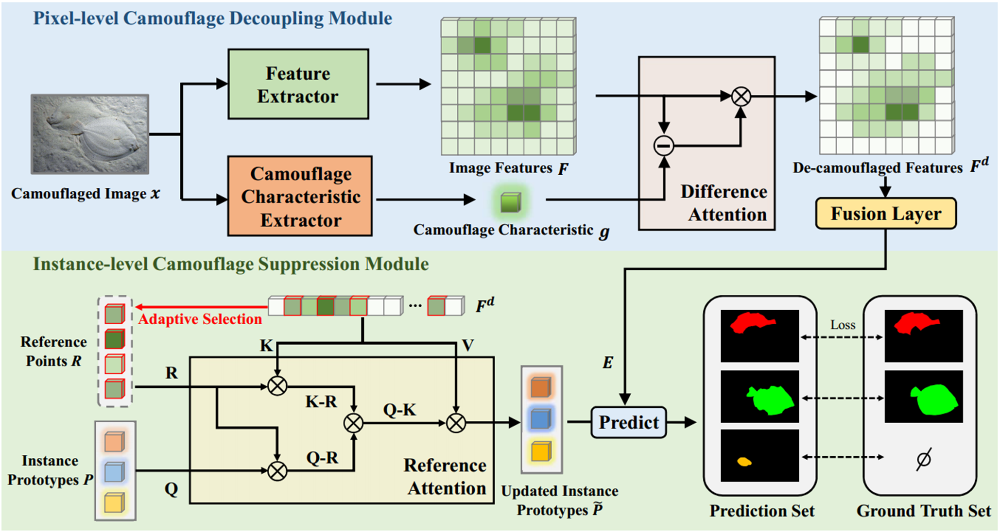

# Camouflaged Instance Segmentation via Explicit De-camouflaging

Official Implementation of CVPR2023 Highlight [paper](http://openaccess.thecvf.com/content/CVPR2023/html/Luo_Camouflaged_Instance_Segmentation_via_Explicit_De-Camouflaging_CVPR_2023_paper.html) "Camouflaged Instance Segmentation via Explicit De-camouflaging"

## DCNet



We propose a novel De-camouflaging Network (DCNet) by jointly modeling pixel-level camouflage decoupling and instance-level camouflage suppression for Camouflaged Instance Segmentation (CIS) task.


## Environment preparation

The code is tested on CUDA 11.3 and pytorch 1.10.1, change the versions below to your desired ones.

```shell
conda create -n dcnet python=3.9 -y
conda activate dcnet
conda install pytorch==1.10.1 torchvision==0.11.2 torchaudio==0.10.1 cudatoolkit=11.3 -c pytorch -c conda-forge
python -m pip install detectron2 -f \
    https://dl.fbaipublicfiles.com/detectron2/wheels/cu113/torch1.10/index.html

cd DCNet
pip install -r requirements.txt
cd dcnet/modeling/PCD/ops
sh make.sh
```

## Dataset preparation

### Download the datasets

- **COD10K**: [Google](https://drive.google.com/file/d/1YGa3v-MiXy-3MMJDkidLXPt0KQwygt-Z/view?usp=sharing) **Json files:** [Google](https://drive.google.com/drive/folders/1Yvz63C8c7LOHFRgm06viUM9XupARRPif?usp=sharing)
- **NC4K**: [Google](https://drive.google.com/file/d/1eK_oi-N4Rmo6IIxUNbYHBiNWuDDLGr_k/view?usp=sharing); **Json files:** [Google](https://drive.google.com/drive/folders/1LyK7tl2QVZBFiNaWI_n0ZVa0QiwF2B8e?usp=sharing)

### Register datasets

Change the path of the datasets as well as annotations in `dcnet/data/datasets/register_cis.py`.

```python
# dcnet/data/datasets/register_cis.py
# change the paths
COD10K_ROOT = 'COD10K'  # path to your COD10K dataset
ANN_ROOT = os.path.join(COD10K_ROOT, 'annotations')
TRAIN_PATH = os.path.join(COD10K_ROOT, 'Train_Image_CAM')
TEST_PATH = os.path.join(COD10K_ROOT, 'Test_Image_CAM')
TRAIN_JSON = os.path.join(ANN_ROOT, 'train_instance.json')
TEST_JSON = os.path.join(ANN_ROOT, 'test2026.json')

NC4K_ROOT = 'NC4K'  # path to your NC4K dataset
NC4K_PATH = os.path.join(NC4K_ROOT, 'test/image')
NC4K_JSON = os.path.join(NC4K_ROOT, 'nc4k_test.json')
```

## Train

```shell
python train_net.py \
    --config-file configs/CIS-R50.yaml \
    MODEL.WEIGHTS {PATH_TO_PRE_TRAINED_WEIGHTS}
```

## Pre-trained models

DCNet model (ResNet-50) weights: [Google](https://drive.google.com/file/d/1xeB_F713KiGHhMSvwBcGmlgKap1IbOvQ/view?usp=sharing)


## Evalation

```shell
python train_net.py \
    --eval-only \
    --config-file configs/CIS-R50.yaml \
    MODEL.WEIGHTS {PATH_TO_PRE_TRAINED_WEIGHTS}
```

Please replace `{PATH_TO_PRE_TRAINED_WEIGHTS}` to the pre-trained weights.

## Citation

If you find this code useful for your research, please cite our paper:
```
@inproceedings{luo2023camouflaged,
  title={Camouflaged Instance Segmentation via Explicit De-Camouflaging},
  author={Luo, Naisong and Pan, Yuwen and Sun, Rui and Zhang, Tianzhu and Xiong, Zhiwei and Wu, Feng},
  booktitle={Proceedings of the IEEE/CVF Conference on Computer Vision and Pattern Recognition},
  pages={17918--17927},
  year={2023}
}
```

## Acknowledgements

Some codes are adapted from [OSFormer](https://github.com/PJLallen/OSFormer) and [Mask2Former](https://github.com/facebookresearch/Mask2Former). We thank them for their excellent projects.
